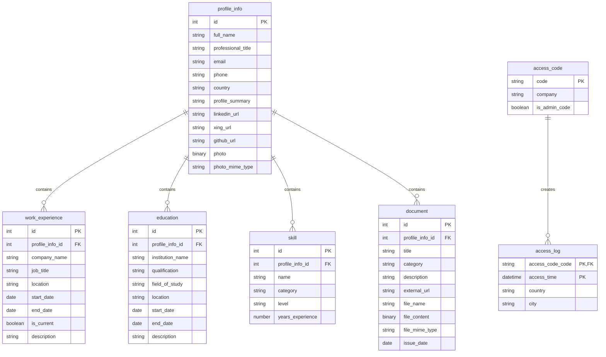

# CVMaker

CV Maker is a single-page application for displaying and managing a personal CV, including profile information, work experience, education, skills, documents, and professional links.

The application uses access-code-based authentication with administrator functionality for editing the CV and managing access codes. Access attempts are logged with location information, while the application is built with a responsive frontend and a PostgreSQL database.

## Additional Information

### Data Model

### Tools Used

[Visual Studio Code](https://code.visualstudio.com/)
[pgAdmin 4](https://www.pgadmin.org/)
[Supabase](https://supabase.com/)
[Vercel](https://vercel.com/)
[ChatGPT 5.6-Sol](https://chatgpt.com/)

### Resources Used

[MDN Web Docs](https://developer.mozilla.org/en-US/)
[StackOverflow](https://stackoverflow.com/)
[Material UI](https://mui.com/material-ui/)
[MUI X Date Pickers](https://mui.com/x/react-date-pickers/)
[Roboto Font](https://fonts.google.com/specimen/Roboto)
[Vite](https://vite.dev/)
[React](https://react.dev/)
[React Router](https://reactrouter.com/)
[Axios](https://axios-http.com/)
[Day.js](https://day.js.org/)
[Express](https://expressjs.com/)
[Prisma](https://www.prisma.io/)
[PostgreSQL](https://www.postgresql.org/)
[JSON Web Tokens](https://jwt.io/)
[IPWhois](https://ipwhois.io/)